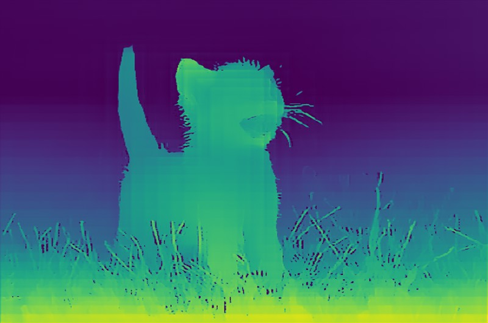

# Depth-Anything-V2 ggml

This is a single-file `ggml` implementation of [Depth-Anything-V2](https://github.com/DepthAnything/Depth-Anything-V2).

## Installation

[ggml](https://github.com/ggerganov/ggml) needs to be installed globally.

To compile the source code, use `cmake`:

```bash
mkdir build && cd build
cmake .. && make
```

## Weights

Please refer to Hugging Face for the required model weights.

| Model | Download Link                                                                |
| ----- | ---------------------------------------------------------------------------- |
| Small | [Download](https://huggingface.co/depth-anything/Depth-Anything-V2-Small-hf) |
| Base  | [Download](https://huggingface.co/depth-anything/Depth-Anything-V2-Base-hf)  |
| Large | [Download](https://huggingface.co/depth-anything/Depth-Anything-V2-Large-hf) |

## Usage

```bash
usage: ./dptv2 <s|b|l> <WEIGHTS> <INPUT_FILE> <OUTPUT_FILE>

Run DPTv2 model on an input image.

options:
  vit-size {s,b,l,g}    Specify the Vision Transformer size (`s`, `b`, `l`).
  weights WEIGHTS       Path to the input image.
  input INPUT_FILE      Path to the input image.
  output OUTPUT_FILE    Path to save the output image.
```

### Example commands

- To save the output to a file:

  ```bash
  dptv2 s weights/vits.safetensors docs/input.jpg docs/vits.jpg
  dptv2 b weights/vitb.safetensors docs/input.jpg docs/vitb.jpg
  dptv2 l weights/vitl.safetensors docs/input.jpg docs/vitl.jpg
  ```

## Example Images

### Input


### Output



---

Thanks to [safetensors-cpp](https://github.com/syoyo/safetensors-cpp), [stb](https://github.com/nothings/stb) and [tinycolormap](https://github.com/yuki-koyama/tinycolormap) for their beautiful work.
